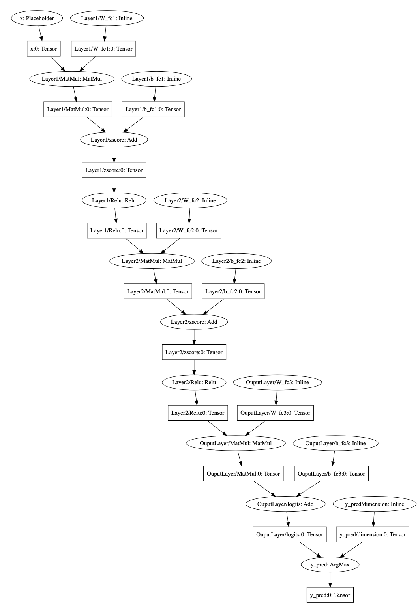

readthedocs: https://utensor-cgen.readthedocs.io/en/latest/

.. readme_begin

.. _readme:

.. _install:

Installation (Python 2 & 3)
===========================

For Users
---------

-  with ``setup.py``

.. code:: console

    $ python setup.py install

-  with pip_

.. code:: console

    $ pip install utensor_cgen

.. _install_dev:

For Developers
--------------

-  with pipenv_

.. code:: console

    # install `utensor_cgen` (develop mode)
    $ PIPENV_VENV_IN_PROJECT=1 pipenv install -d

    # spawn a subshell and activate virtualenv
    $ pipenv shell

    # get help message of `utensor-cli`
    $ utensor-cli -h

Troubleshooting with pipenv_
~~~~~~~~~~~~~~~~~~~~~~~~~~~~

- If you have troubles with installation using pipenv_, try

  .. code:: console

    $ PIPENV_VENV_IN_PROJECT=1 pipenv install -d --skip-lock
- there is known issue of pip_ and pipenv_, plz refer to this
  `issue <https://github.com/pypa/pipenv/issues/2924>`_ for detail

  -  short answer: downgrade to ``pip==18.0`` may help :)

- Tensorflow_ requires ``setuptools<=39.1.0`` (the latest is ``40.4.3``
  by the time this README is writen)

  - plz downgrade to ``setuptools==39.1.0``
  - my recommendation is to use ``virtualenv``

Overall Architecture
====================

\ |utensor-cli-components|

Basic Usage
===========

Model File Inspection
---------------------

.. code-block:: console

  $ utensor-cli show <model.pb>

Show all nodes and detailed information of given pb file or
a :class:`.uTensorGraph` pickle file

Run ``utensor-cli show --help`` for detailed information.

Convert Model File to C/C++ Code
--------------------------------

**IMPORTANT**: ``pb`` file is deprecated in favor of Tensorflow 2.x, please refer to `End-to-End Training with Keras`_ for detail

.. code-block:: console

  $ utensor-cli convert <model.pb> \
    --output-nodes=<node name>[,<node name>,...] \
    [--config=config.toml]

Convert given pb file into cpp/hpp files.

Note that ``--output-nodes`` is required options. It's the names of
nodes you want to output, seperated by comma for multiple values.

In graph theory terminology, they are ``leaf`` nodes of your graph.

Use ``--config`` to pass a configuration file to the cli, you can use ``generate-config`` command to generate one (see below).

example
~~~~~~~

.. code-block:: console

  $ utensor-cli convert simple_model.pb --output-nodes=pred,logits

Run ``utensor-cli convert --help`` for detailed information.

Configuration
-------------

``utensor-cli`` use ``toml`` as configuration format.

You can generate configuration file of given target as following:

.. code-block:: console

  $ utensor-cli generate-config --target <target name> [-o filename.toml]

This command will generate a ``toml`` file listing all configurable values with its defaults.

You can modify the value and pass the file to cli with ``--config`` flag.

example
~~~~~~~

.. code-block:: console

  # generate config file
  $ utensor-cli generate-config --target utensor -o myconfig.toml

  # after editting myconfig.toml
  $ utensor-cli convert mymodel.pb --config=myconfig.toml --output-nodes=output,...

Use :mod:`utensor_cgen` as Library
==================================

.. subgraph-match-begine

Subgraph Isomorphic Matcher
---------------------------

With :class:`.uTensorGraphMatcher`, performing isomorphic subgraph matching
along with replacing or manipulating the matched subgraph(s) takes just a
few line of code:

.. code-block:: python

  from utensor_cgen.matcher import uTensorGraphMatcher

  # `pattrn_ugraph` is the pattern to match with
  pattrn_ugraph = ...
  matcher = uTensorGraphMatcher(pattrn_ugraph)

  # a larget graph to perform subgraph match
  subject_ugraph = ...

  # matches is a list of `uTensorGraphMatch` objects
  matches = matcher.match_all(subject_ugraph)
  if matches:
    # do stuff with the matches

Use Case: Node Fusion
~~~~~~~~~~~~~~~~~~~~~

Note: we'll use **operation**/**node**/**layer** interchangeably in the
documentation

-  It's commonly seen pattern in convolution neural network (``CNN``),
   ``conv -> relu -> pooling``. That is, a 2D convolution followed by a
   relu layer and then a pooling down sampling layer.
-  With our :class:`.uTensorGraphMatcher`, you can locate such pattern in your
   ``CNN`` model and fuse/replace matched nodes into one optimized
   :class:`.QuantizedFusedConv2DMaxpool` node.

  -  Left: original graph
  -  Middle: matched convolution layer
  -  Right: replace the matched layer with specialized
     ``QuantizedFusedConv2DMaxpool`` node

\ |conv-pool-fuse|

Use Case: Dropout Layer Removal
~~~~~~~~~~~~~~~~~~~~~~~~~~~~~~~

-  Though ``dropout`` is an effective technique to improve training
   performance of your model, it's not necessary during inference
   phrase.
-  In the mainstream frameworks such as `Tensorflow`_ or `PyTorch`_,
   an ``dropout`` layer is typically implemented with other elementary
   operations/nodes. As a result, finding and removing those nodes for
   inference optimization (both in model size and prediciton time) is
   not trivial and error prone.
-  With our :class:`.uTensorGraphMatcher`, you can find and remove the dropout
   nodes as illustrated in the following picture.

   -  Left: original graph with dropout Layers
   -  Middle: matched dropout layers
   -  Right: graph with dropout layers removed

\ |cnn-dropout|

We use mainly `Tensorflow`_ for declaring the pattern graph for matcher now.

High-level graph builder is on its way, see `Future Works <#future-works>`_ for detail.

.. subgraph-match-end

.. offline-tensor-alloc-start

Offline Tensor Memory Allocation
--------------------------------

Considering following simple multi layers perceptron (`simple_mnist.pb`_):

\ |mlp-alloc-graph|

Once enabled the optimization transformer, ``tensor_alloc``, an offline tensor memory allocation planner,
``utensor-cli`` will generate ``uTensor`` runtime codes that use following optimized allocation plan:

\ |mlp-alloc|

- y-axis: tensor names ordered by topological sorting
- x-axis: these are the memory span occupied by each tensor, that is, the memory address offset and
the size of the tensor

.. offline-tensor-alloc-end

Tutorials
=========

-  `End-to-End Training with Keras`_
-  `Extending uTensor Backend by Adding Custom Operators <https://github.com/uTensor/utensor_cgen/tree/master/tutorials/add_custom_operators>`_
-  `Wrighting Plugins: Component Registration <https://github.com/uTensor/utensor_cgen/tree/master/tutorials/component_registration>`_

How to Serve Your Model on uTenosr
==================================

Keras_ (Recommended)
--------------------

Please refer to `End-to-End Training with Keras`_ for detail

TensorFlow_
-----------

1. Freeze your `tensorflow.Graph`

  - please refer to this `issue track <https://github.com/tensorflow/tensorflow/issues/27614>`_ for detail
  - especially this `comment <https://github.com/tensorflow/tensorflow/issues/27614#issuecomment-571889676>`_ by Robin2091

2. Follow instructions in :ref:`install` section to install :mod:`utensor_cgen`

  - then `utensor-cli` should be available in your console

3. Inspect your pb file to find the output node

  .. code-block:: console

    # verbose mode
    $ utensor-cli show graph.pb

    # or oneline mode
    $ utensor-cli show graph.pb --oneline

4. convert the protobuf file to C/C++ source code with `utensor-cli`

  - supose the output node is ``pred`` in **graph.pb**

  .. code-block:: console

    $ utensor-cli convert --output-nodes=pred graph.pb

5. Compile your application code with generated C/C++ and weights files

  - You should find your model C/C++ and weights files in directories
    **models** and **constants** respectively

\ |convert-example|

Testing
=======

1. follow the steps in :ref:`install_dev` section
2. run tests as following

  .. code-block:: console

    # run with `make`
    $ make tests

    # run with `pipenv`
    $ pipenv run pytest -m 'not slow_test and not deprecated' tests

.. design philosophy
..     `12 Factor CLI App <https://medium.com/@jdxcode/12-factor-cli-apps-dd3c227a0e46?fbclid=IwAR1Gfq0D7oh3b-mXaIMV3RwYu39TAPrPXfz5sBKC4Rz1t-cckvC8WjBVl_w>`_

Future Works
============

1.  High-level graph builder api for building :class:`.uTensorGraph`.

    - Currently ``utensor_cgen`` uses ``TensorFlow`` api for building IR graph, ``uTensorGraph``.
    - With high-level graph builder, users can build their ``uTensorGraph`` easily and do not need
      to take care of the integrity of the graph.
      The builder will take care of it automatically.

.. _pip: https://pip.pypa.io/en/stable/
.. _pipenv: https://github.com/pypa/pipenv
.. _Tensorflow: https://www.tensorflow.org
.. _Keras: https://keras.io/
.. _End-to-End Training with Keras: https://github.com/uTensor/utensor_cgen/tree/master/tutorials/end2end_training
.. _PyTorch: https://pytorch.org/
.. _uTensor: https://github.com/uTensor/uTensor
.. _simple_mnist.pb: https://github.com/uTensor/utensor_cgen/blob/develop/tests/deep_mlp/simple_mnist.pb

2. Automaic-Update TFLite fbs file

   - `schema files <https://github.com/tensorflow/tensorflow/tree/cf28969fb2ea72c9738cd3acdddc0b69fd7dff5e/tensorflow/lite/schema>`_

.. readme_end

.. |cnn-dropout| image:: doc/source/_images/cnn_dropout.png
    :alt: cnn-dropout
.. |conv-pool-fuse| image:: doc/source/_images/conv_pool_fuse.png
    :alt: conv-pool-fuse
.. |convert-example| image:: doc/source/_images/convert_example.png
    :alt: convert-example
.. |mlp-alloc| image:: doc/source/_images/mlp_alloc.png
    :alt: mlp-alloc

.. |utensor-cli-components| image:: doc/source/_images/utensor-cli-components.drawio.svg
    :alt: utensor-cli-components

.. TODOs
.. =====

.. 1. (done?) core code generator implementation

..    -  We need some refactoring, PRs are welcomed!

.. 2. type alias in C/C++

..    -  ex: use ``uint8_t`` or ``unsigned char``?
..    -  a lot more about this....

.. 3. Relation among snippets/containers

..    -  shared template variables? (headers, shared placeholders...etc)

.. 4. Better configuration schema

..    -  json
..    -  yaml
..    -  or ?
