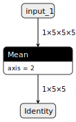

# Adding custom operators

This tutorial shows how to register custom operators in the uTensor code generation tools using the plugin system. We will start by defining a custom Layer in Keras using existing Tensorflow operators for clarity and brevity, however extending the concepts in this tutorial to map fully custom framework operators to the uTensor form should be straightforward.  

## The operator lifecycle


The operator lifecycle loosely falls into 3 categories, the Frontend, the Transformer, and the Backend. 

- The goal of the `Frontend` is to lift tensor and operator graphs from the various frameworks (Tensorflow, ONNX, etc.) into the uTensor Intermediate Representation (IR). At this stage, the IR makes no assumptions on whether or not a particular operator is "supported", so for the sake of this tutorial is therefore largely ignored. Finally, at the end of this stage and right before the next is the `Legalizer`. This legalization simply ensures that the IR can be processed in the most generic form. For example, we might simply rename `Dense` or `DenseLayer` to `FullyConnectedOperator`.
- The goal of the `Transformer`, as its name implies, is to transform uTensor IR graphs. For example, generating memory plans, rewriting graphs, and generally optimizing inference. Again, this is predominantly operator agnostic so is mostly ignored in this tutorial. 
- The goal of the `Backend` is to do the final lowering of an optimized IR into either code or binary forms. At the end of the transformation pipeline, the final graph is then *lowered* into a target `Backend`. This lowering process is Backend specific and allows the backend to inject additional attributes into the IR before finalizing a strategy for mapping IR components to their respective backend handlers. For example, in the uTensor backened we can inject namespace information to prioritize CMSIS handlers over reference floating point depending on if the operator in question is quantized. Next, the uTensor backend can use these respective handlers to compose a set of code snippets, which ultimately becomes the output model code.


This means there are a total of 4 locations where we might want to register our custom operator, but some of them may be optional based on use-case:

1. Frontend parsing
2. Legalization
3. Backend Lowering
4. Backend Component
5. Backend Snippet

## Adding custom operators workflow

To keep things from being tied to a particular frontend, we will work with an op that is already present in TFLite, but targets a custom runtime operator in uTensor. Suppose the runtime interface for this operator is fixed and looks something like:

```c++
namespace MyCustomOpNamespace {

template <typename T>
class ReductionMeanOperator : public OperatorInterface<2, 1> {
 public:
  enum names_in : uint8_t { in, axis };
  enum names_out : uint8_t { out };

 protected:
  virtual void compute() {
    //...
  }
};

} // MyCustomOpNamespace
```

### Adding an Operator Eval Snippet

The first thing we will want to do is make sure the generated code maps the correct input and output tensors to their associated names in the runtime op. We start by declaring these names in an `OpEvalSnippet`. From the op description above this looks like "in", "axis", and "out", and can be done with the following code snippet:

```python
class ReductionMeanEvalSnippet(OpEvalSnippet):
    __inputs__ = ["in", "axis"]
    __outputs__ = ["out"]
```

### Writing a Backend Component

The backend component is the meat of the operator code generation process. For the uTensor backend, this can be creating custom constructor parameters, overriding the default declaration in code, and describing the evaluation code for this operator. Once this is done, we just need to register the component in the global OperatorFactory:

```python
@OperatorFactory.register
class _ReductionMeanOperator(_Operator):
    namespaces = ("MyCustomOpNamespace",)
    op_type = "ReductionMeanOperator"

    # the value returned by this method will be used as
    # the constrcutor parameters as is.
    # In utensor backend, it should return a tuple of string.
    # Since there is no parameters for `MeanOperator`, an empty tuple is returned
    @classmethod
    @must_return_type(Hashable)
    def get_constructor_parameters(cls, op_info):
        return tuple()

    # snippet that calls op's constructor and will be placed in the
    # the initializer list of the model class
    def get_construct_snippet(self, op_var_name):
        return OpConstructSnippet(
            op=self,
            templ_dtypes=[self.in_dtypes[0]],
            op_var_name=op_var_name,
            nested_namespaces=type(self).namespaces,
        )

    # snippet which declares the op
    def get_declare_snippet(self, op_var_name, with_const_params=True):
        return DeclareOpSnippet(
            op=self,
            templ_dtypes=[self.in_dtypes[0]],
            op_var_name=op_var_name,
            nested_namespaces=type(self).namespaces,
            with_const_params=with_const_params,
        )

    # snippet that eval the op
    def get_eval_snippet(self, op_var_name, op_info, tensor_var_map):
        return ReductionMeanEvalSnippet(
            op_info=op_info,
            templ_dtypes=[self.in_dtypes[0]],
            op_name=op_var_name,
            tensor_var_map=tensor_var_map,
            nested_namespaces=type(self).namespaces,
        )

```

### Lowering an Operator to our Backend Component

After registering the operator backend component in the OperatorFactory, we need to notify the graph lowering engine to make this target available. Right now, this is a simple registry of operator names and namespaces, but will soon be a proper lowering strategy engine:

```python
@uTensorRearchGraphLower.CodgenAttributes.register("ReductionMeanOperator")
def handler(op_info):
    op_info.code_gen_attributes["namespaces"] = ("MyCustomOpNamespace",)
```

### Legalizing at the Frontend

It turns out there was a disconnect between the original custom operator naming, `ReductionMeanOperator` and the naming present in the TFLite file `Mean`, so we need to indicate to the Legalizer that these ops need to be renamed:

```python
# legalize all `Mean` to `ReductionMeanOperator`
TFLiteLegalizer.register_op_rename(old_name="Mean", new_name="ReductionMeanOperator")
```

### Registering the new Operator in uTensor CLI


Our custom op registration is implemented as a normal python module.
We can load as many custom modules as we want with `--plugin` flag in `utensor-cli`. For example, the following shows how to load our custom operators:
```bash
$ utensor-cli --plugin custom_operators convert tf_models/reduceModel.tflite
```
